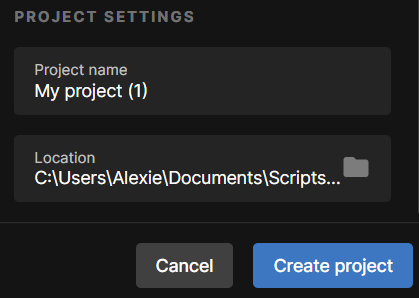

# Project One: Adventures of A Little Blue Witch
## By Sejal and Alexie

### Creating the File:

**Step 1:** open your unity hub and click the new project button in the top right corner. 

**Step 2:** Select the 2D core template and enter a project name in the bottom right corner as well a file location. 

**Note:** This game was created using the editor version 2021.3.19f1 LTS.Make sure you select the right editor version, it's above the templates. 

**Step 3:** Once all that is done you can now create the project by clicking the create project button in the bottom left corner. 

**Step 4:** Once your project is created, download the Assets folder available with our repository and replace it with your local Assets to load the pre-built game and also get local access to all our assets.

### Understanding Unity User Interface:

Now that you have opened the project lets just define and explain some of the windows. 

The left column labeled hierarchy contains all the objects in the game currently its just the scene and the main camera. Any game objects that you would like to be in the game you can drag and drop them into the hierarchy or directly into the scene.

The scene is the window directly in front center you can see at the top there are different windows the scene view is where all the editing happens and the game view is a window that mimics what the player would see while playing the game.

In the bottom right columns are your files. If you have more files you would like you can just drag and drop them there. You can see that there are a lot of files there, some called Prefab and Script, these are all premade objects to help you make the game quicker. 

Lastly we have the window to the right called inspector when you click an object in the left hierarchy the inspector will show you all the features and characteristics about that game object. 

Lastly, to run your game you click the play button, while its running you can pause it with the second button. 

### Prefabs 
We have some prefabs for you. These are objects already made with animations, movement and storage collection so all you have to do is drag and drop them to your desired location in the scene.  Some prefabs are enemies, player, Healing and mana potions and many more. Next the Scripts File contains many c++ scripts that you can apply to objects to give them traits such as the Player input which allows an object to move and collect things, sound manager that controls the sound in the game or save manager that helps with loading and saving the game. There are also some sprites there if you want to make a character from scratch. 

### First Getting start:

Before we start, let's open a few windows that we will be needing like the animation, animator and tile pallet menu. Click window, 2D, Tile Pallet and a window should pop up on your screen you can place that anywhere but the recommended position is the right menu with the inspector. Just click on the name of the tile pallet that just popped up and drag it beside the inspector. Now we are going to do the same for the animator click window, animation animator. Finally click window, animation, then animation again and drag this one to beside the console window near the bottom. 

### Scene building:

Now that we have everything set up we can start building the game. You are going to right click on the hierarchy and create an empty object then drag and drop your background images from your files into the empty game object and recycle them to the preferred size. There are some premade tile palettes that you can use or you can load in your own tile map sheet and make a tile palette using that. You can look at our pre-built scene available under “Assets/Scenes” called LevelScene and use it as an inspiration to create your own level! 

Note: It is mandatory that you use our pre-built Main Menu and Credits Scene if you want to use our Assets. This will also make it easier for you to build a complete game as the Main Menu already has the required assets attached to it to successfully run the game. Once you complete your “Level” scene, all you need to do is navigate to it correctly from the main menu (Further explained in the Changing Scenes Section).

### Make your own tile map instructions:

### Using Tilemap to Make Game:

You can find the tile palettes in the TileSprites > TileMap> GroundTiles.prefab double click it and it should open in the tile palette window. Now in the hierarchy right click > click 2D Object > Tilemap > Rectangular, name the title map Ground. On the grid it is recommended to make multiple tilemap renders, you can just duplicate the one that was made and named ground. You should have different ones for the ground that the player is going to be walking one and a different one for background obstacles. Now that you have everything set up you can start to make your level. Click the third icon on the tile palette window, the paint brush icon and click the tile you want to paint from the tile palette window and apply it to  a section of the grid.The second button is a move button so after placing a tile you can select the move button then move the tile around the screen till its in the appropriate spot. The sixth icon is the eraser, you can erase a tile you accidentally placed by switching to that button. The last button is a fill button, if you have a closed outline you can use the fill button to fill in the shape. Now you can make your level. 

**Note:** you will have to sort your layers by clicking the tile renders on the grid going to the inspector, additional setting and changing the order in layer, a higher number is closer to the user and a lower number is further from the user.  

### Mechanics:

Once your level is created but before adding a player, colliders must be added to the tilemap so that the player does not fall through the objects. To add the collider, select the object, go to the inspector window and click “Add Component” > Tilemap > Tilemap Collider 2D. You will also need to add a rigidbody. Click “Add Component” > Physics 2D > Rigidbody 2D. Then the Rigidbody needs to be set from the default dynamic position to static. 

### Adding Objects:

**Character Creation:**

There are character, enemy prefabs that you can drag and drop around your scene. To find these characters go to Assets > Prefab Folder.

**Enemy:**

The enemy can be customized by clicking on them in the hierarchy and looking at the inspector menu. You can change their health, damage dealt, movement speed, location they walk. 

**Character:**

Customizations for character health, damage dealt, movement speed, jump speed, weight.

**Potions:**

There are blue potions that count as mana and a red potion that restores health when lost. 

**Note:** May an Empty game object to store all you enemies and a separate one for all your potions. 

### Camera Follow:

If you made your level bigger than the camera size the camera will have to follow your player. In the Assets > Scripts folder there is a file called “CameraFollow” select the MainCamera and drag the Camera Follow script into the inspector tab. You will need to drag the player from the hierarchy menu and add the player to the Target field 

**Note:** this will not be necessary if your level is the size of the camera view

### Sound Management:

**Background Sound:**

To create background sound for your game, go to the music folder and drag in the prefab level music into the hierarchy. You can drag your music into the music folder and then from the music folder into the audio source, audio clip section. You can control the sound level with the volume, sound is between 0-1.

**Making pop up menus (like death screen or level up):**

All the above menus are prefabs that you can use in the game. The first one is a utility menu that's mapped to the escape button to open and close. The second menu is the death screen button that is mapped to appear when the player's health goes to zero. The last menu is a pop up that first appears after the start menu to allow players to name their character. 

### Saving and loading states:

Saving and Loading is being done through the SaveManager and JSONLoaderSaver scripts under “Assets/Scripts”. Our Save and Load Scripts require the use of our prebuilt player in your game. If you aren’t using our pre-built Player you won't be able to use our Save and Load functionality as is and will have to adjust your own players to make it work with it!

We can currently save 4 parameter: Player Name, Health, Attack Damage Done, and Potions Collected or the Score within our PlayerInput script

If you are also using our pre-build “Level End Menu” save should be ready to use for you. Otherwise, you will have to connect our Save Function (Assets\Scripts\SaveManager) to your save button wherever you create it within the scene. Once you have created your Save Button, navigate to it’s Inspector and drag and drop the player object from your hierarchy into the onClick () Component:

You will then have to use the DropDown Menu to select the Save Manager List and then the SavePlayer Method:

As for the Load Button on the Main Menu, if you are successfully saving the Player Stats without and errors, all you need to do is to change the SceneLoader Method to get to your level scene, which is done the same way as explained in the next section but on Line 22 of the respective script this time.

The LoadGame methods works by checking is the LoadPlayer Method is returning anything other than “null” to load the saved values. If nothing is saved locally, LoadPlayer() will always return a null value.

### Changing Scenes:

Changing between differents Scenes can be easily done through the scripts. Since you are required to use our prebuilt Main Menu, the only edit required by you to successfully get to your Level Scene is to be done in the MainMenu Script (“Assets/Scripts/MainMenu”). Once you have created and named your Level Scene, navigate to the MainMenu Script and replace line 12 as follows:  SceneManager.LoadScene("Name of your level Scene");

